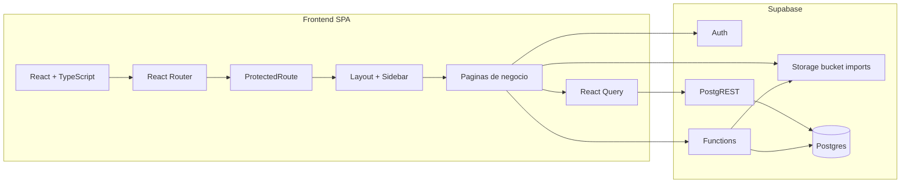
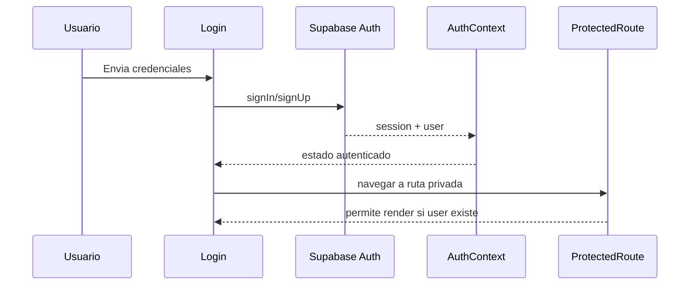
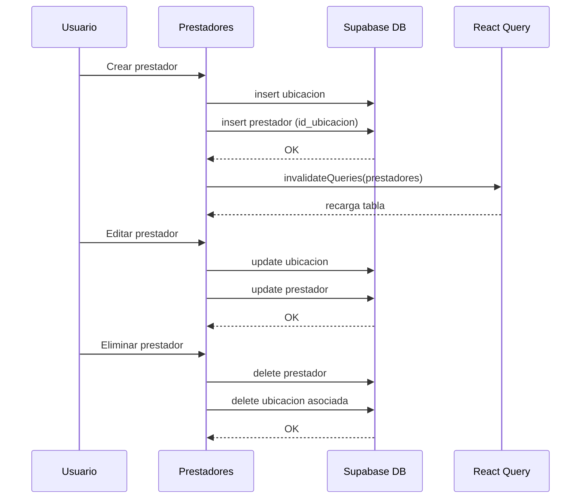
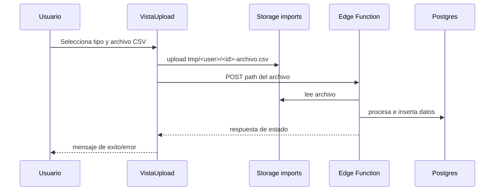
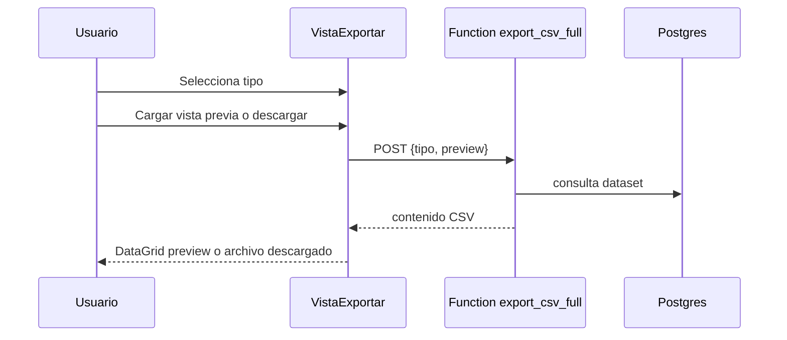
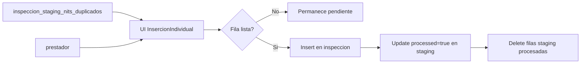
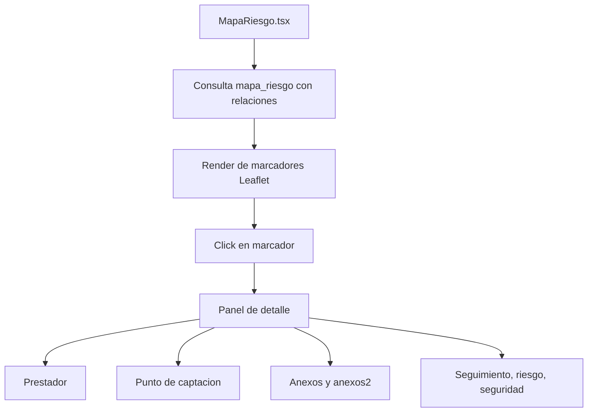

# Diagramas - UES Valle

Diagramas en Mermaid para arquitectura, navegacion y flujos operativos.

> Puedes visualizarlos en VS Code (extension Mermaid) o en https://mermaid.live

---

## 1) Arquitectura general



---

## 2) Mapa de rutas

```mermaid
flowchart TD
  R0[/] --> R1[/login]

  R1 --> R2[/dashboard]
  R2 --> R3[/prestadores]
  R3 --> R4[/prestadores/:id]

  R2 --> R5[/tecnicos]
  R2 --> R6[/solicitantes]
  R2 --> R7[/muestras]
  R2 --> R8[/inspeccion]
  R8 --> R9[/inspeccion/InsercionIndividual]
  R2 --> R10[/mapa]
  R2 --> R11[/exportar]
  R2 --> R12[/subir]

  R2 --> R404[*]
```

---

## 3) Flujo de autenticacion



---

## 4) Flujo CRUD de prestadores



---

## 5) Flujo de carga masiva CSV



---

## 6) Flujo de exportacion



---

## 7) Flujo de resolucion de duplicados (inspeccion staging)



---

## 8) Flujo de consulta en mapa de riesgo


