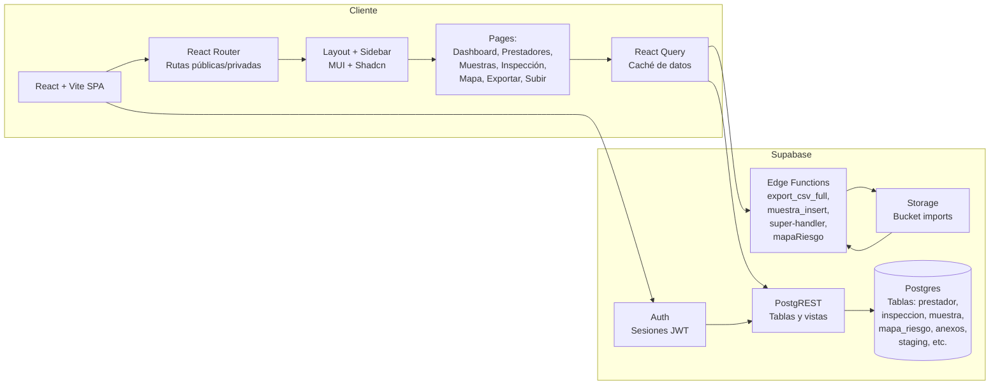
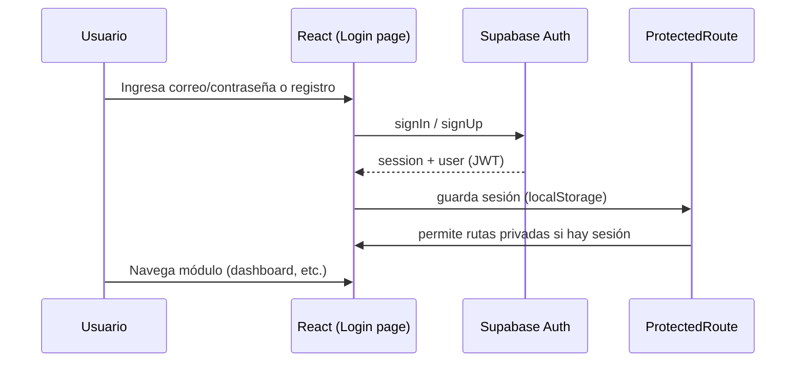
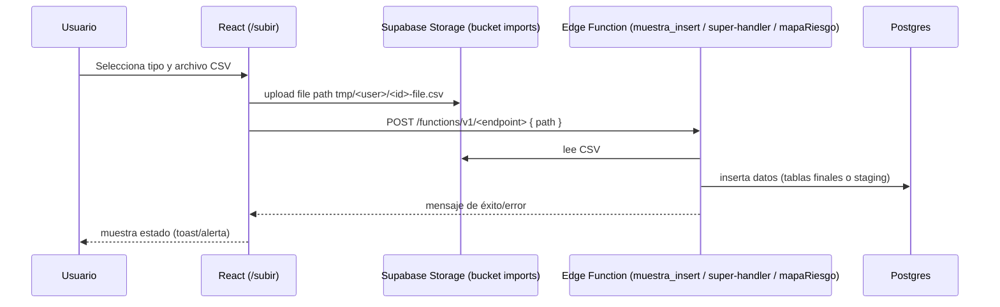
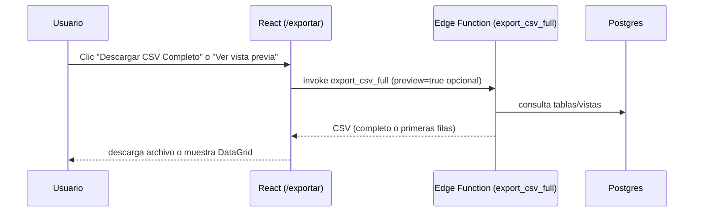

# Diagramas - UES Valle

Referencias visuales para arquitectura y flujos clave. Los diagramas están en Mermaid; puedes visualizarlos en VS Code (extensión Mermaid) o en https://mermaid.live.

## 1) Arquitectura general


## 2) Flujo de autenticación


## 3) Flujo de carga masiva


## 4) Flujo de exportación CSV


## 5) Flujo de resolución de duplicados (Inserción Individual)
```mermaid
flowchart LR
  Staging[inspeccion_staging\n registros duplicados por NIT]
  UI[UI InsercionIndividual\nDataGrid editable]
  Prest[prestador\n(catálogo por NIT)]
  Final[inspeccion\n(tabla final)]

  Staging --> UI
  Prest --> UI
  UI -->|asigna id_prestador\npor cada fila lista| Final
  UI -->|marca processed=true\ny elimina staging| Staging
```
